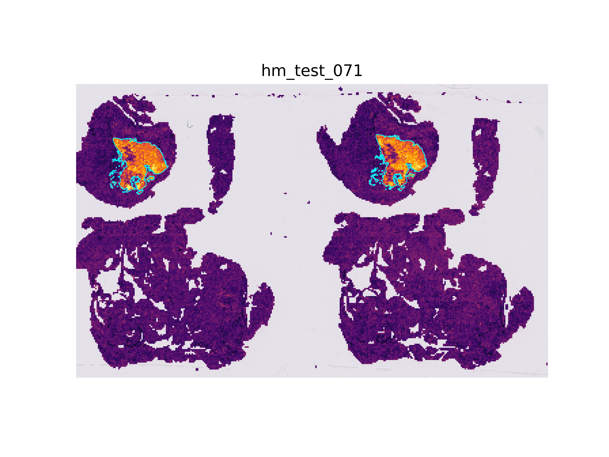

# Self-Supervised Deep Metric Learning for Prototypical Zero-shot Lesion Retrieval in Placenta Whole-Slide Images

Official repository for *ProtoSSDML: Self-Supervised Deep Metric Learning for Prototypical Zero-shot Lesion Retrieval in Placenta Whole-Slide Image*.

This repository contains the training pipeline presented in the paper, the evaluation code for CAMELYON16 and a demo notebook.

Model weights and a sample support set for CAMELYON16 can be downloaded from [this repository](https://drive.google.com/drive/folders/1H6A4JS3D06DqE4QfWbEb1Sx1pQk8wBtz).

### Installation
You can install most requirements from `requirements.txt`.
```
pip install -r requirements.txt
```

You will also need to install ASAP and the multiresolutionimageinterface library to handle CAMELYON16 annotations.

### Training

An example configuration file is available in [`configs/local_train.conf`](configs/local_train.conf). We advise you to read through the [`lib/parser.py`](lib/parser.py) file to see the different training parameters available. The training WSIs should be listed in a .json file as shown in [`./camelyon_normal_split.json`](./camelyon_normal_split.json). When ready, start training with:
```
python train.py -c configs/local_train.conf
```

### Evaluation
The patch- and slide-level zero-shot evaluation pipeline can be run from the `eval.py` file. The model_dict variable can be modified to evaluate other model/transforms. The slides to be used for prototype definition should be listed in a .json file as shown in [`./camelyon_normal_split.json`](./camelyon_normal_split.json). To run patch-level evaluation, run:
```
python eval.py --model protossdml --name protossdml_camelyon16 --level patch
```

### Demo notebook
The [`demo.ipynb`](./demo.ipynb) notebook contains an example of heatmap generation for a test WSI from CAMELYON16 using a support set generated during the zero-shot, simulated low-data regime evaluation.

  